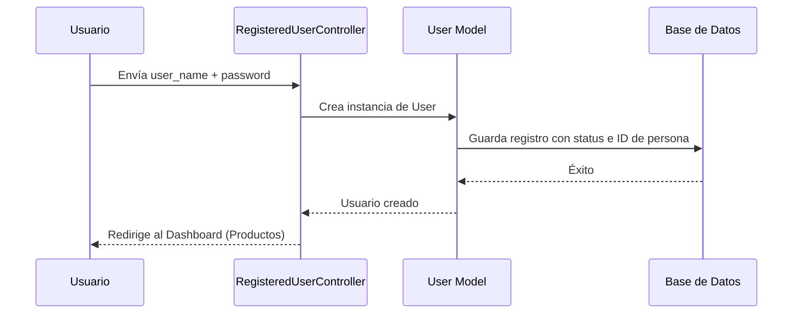

# Arquitectura del Proyecto - ProductosPro Laravel

Este documento describe la estructura técnica, patrones de diseño y flujo de datos implementados en el sistema **ProductosPro**.

## 🏗️ Modelo de Arquitectura: MVC (Modelo-Vista-Controlador)

El proyecto utiliza el patrón MVC nativo de Laravel 10 para separar la lógica de negocio, los datos y la interfaz de usuario.

### 🧩 Componentes Principales

1.  **Capa de Modelos (`app/Models`)**:
    *   `User`: Gestión de identidad con campos personalizados (`user_name`, `status`).
    *   `Product`: Entidad central con soporte para imágenes.
    *   `Person`, `Purchase`, `Role`: Modelos de soporte para la estructura heredada.

2.  **Capa de Controladores (`app/Http/Controllers`)**:
    *   `ProductController`: Maneja el ciclo de vida de productos (CRUD) y el sistema de archivos (Storage).
    *   `CartController`: Lógica del carrito de compras basada en `Session`.
    *   `ProfileController`: Gestión de perfiles con validación de seguridad.

3.  **Capa de Vistas (`resources/views`)**:
    *   Implementado con **Blade Engine**.
    *   **Layout centralizado** (`layouts/app.blade.php`) basado en Bootstrap 5 para garantizar cohesión visual.

---

## 🔒 Sistema de Seguridad (Auth)

Se ha realizado una refactorización de **Laravel Breeze** para eliminar la dependencia de un correo electrónico (`email`).

**Flujo de Autenticación:**

---

## 🛒 Módulo del Carrito de Compras

El carrito utiliza el driver de `session` de Laravel para almacenar temporalmente los productos antes de una compra final.

- **Persistencia**: La sesión se mantiene mientras el usuario esté autenticado.
- **Interactividad**: Uso de **jQuery/AJAX** para actualizar cantidades en tiempo real sin recargar la página.

---

## 📂 Gestión de Archivos (Imágenes)

Se utiliza el `FileSystem` de Laravel configurado en el disco `public`.

- **Ubicación**: `storage/app/public/products`.
- **Acceso**: Vinculado mediante `php artisan storage:link` para que las imágenes sean accesibles desde la carpeta `/storage`.
- **Validación**: Los archivos son validados por tipo (mimes:jpg,png,jpeg) y tamaño (max:2048kb).

---

## 🧪 Calidad y Pruebas (QA) - Sprint 4

El proyecto implementa pruebas automatizadas para asegurar la integridad de las funciones críticas.

- **Feature Tests**: Pruebas de integración que simulan interacciones de usuario (Auth, CRUD de productos, Carrito, Voluntariado).
- **Unit Tests**: Pruebas de lógica aislada en modelos y servicios.
- **Herramientas**: PHPUnit y Laravel Testing Framework.

## 🚀 Despliegue y CI/CD

- **Integración Continua (CI)**: GitHub Actions ejecuta el pipeline de pruebas en cada pull request.
- **GitFlow**: El desarrollo se organiza en ramas `feature/`, integrándose a `develop` y finalmente a `main` para lanzamientos estables.

---
*Documentación técnica - Sprint 4.*

